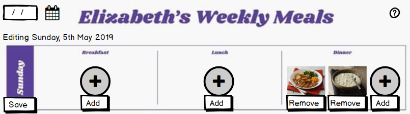

# Wiltshire Farm Foods

---

## Updates for 2019

* Kentico upgrades
* Microsoft Dynamics regression testing
* Microsoft SharePoint integration
* Additional Payment methods
* Personalisation

---

### Payments

@snap[north span-50]

@snapend

@div[left-30 fragment]

@divend

@div[right-30 fragment]

@divend

Note:

* Existing payment methods - Credit/debit card (MasterCard, Visa, Maestro and Solo), Cash, Cheque and Voucher (paper)
* Additional payment methods - Gift Card, eVoucher code, PayPal
* Enabling 3rd parties to contribute to or simply fund the customer's account
  
---

### Tailored

@div[left-30]

@divend

@div[right-60]
@ul[brighten]

* Food allergies & intolerances
* Dietary restrictions
* Personal preferences
  
@ulend
@divend

Note:

* Allergies, food intolerances and other medical conditions e.g. Celiac disease, diabetes
* Set other types of dietary restrictions such as religion e.g. halal meat
* Set personal diet preferences e.g. low sugar / low fat / low salt
  
---?image=assets/images/meal_planner__smallest.jpg&position=right&size=50%

@snap[west span-50]

## Meal Planner

Not just another way to order food - but a personal organiser assisting in the often difficult task of planning meals in a way that provides variety and a well balanced diet.

@snapend

---

## Editing the Meal Planner

Note:

* Rules and logic based on the customer's requirements and order history

---

### AI ChatBot & Live Chat

Note:

* Helping with search and making recommendations
* Interfacing with Meal Planner and order history
* Hand-over to live chat leveraging 24/7 availability

---

### Franchisee support

eLearning platform - not just marketing literature

Note:

* Videos covering best practices and training for new employees
* Topics such as local marketing and social media engagement
  
---

### Apetito App

---