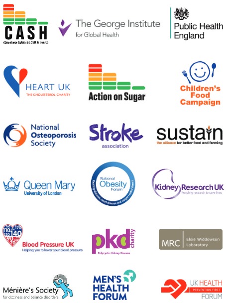
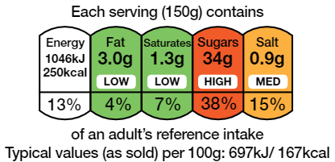
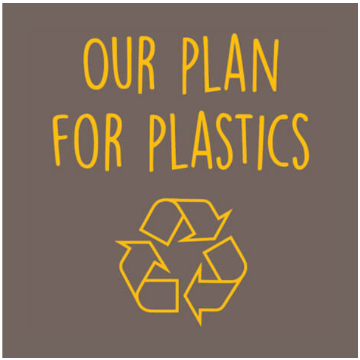
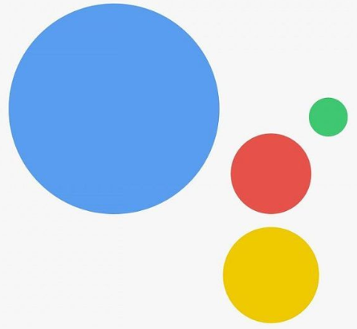

# Wiltshire Farm Foods

---
@title[Updates for 2019]

## Updates for 2019

* Kentico upgrades
* Microsoft Dynamics regression testing
* Microsoft SharePoint integration
* Additional Payment methods
* Personalisation

---
@title[Gift Card]

### Gift Card

@snap[centre]
{ border: none; }
@snapend

Note:

* Existing payment methods - Credit/debit card (MasterCard, Visa, Maestro and Solo), Cash, Cheque and Voucher (paper)
* Additional payment methods - Gift Card - as per FAQ

---
@title[eVoucher & PayPal]

### Additional payment methods

@div[left-50 fragment]

@divend

@div[right-50 fragment]

@divend

Note:

* Additional payment methods - eVoucher code, PayPal
* Enabling 3rd parties to contribute to or simply fund the customer's account
  
---
@title[Tailored]

### Tailored to the individual's needs

@div[left-30]

@divend

@div[right-60]
@ul[brighten]

* Food allergies & intolerances
* Dietary restrictions
* Personal preferences
  
@ulend
@divend

Note:

* Allergies, food intolerances and other medical conditions e.g. Celiac disease, diabetes
* Set other types of dietary restrictions such as religion e.g. halal meat
* Set personal diet preferences e.g. low sugar / low fat / low salt
  
---?image=assets/images/meal_planner__smallest.jpg&position=right&size=50%
@title[Meal Planner]
@snap[west span-50]

## Meal Planner

Not just another way to order food - but a personal organiser assisting in the often difficult task of planning meals in a way that provides variety and a well balanced diet.

@snapend

---
@title[Healthy eating]

## Healthy Eating

Note:

* Initiatives such as Eatwell Guide, Change 4 life etc.
  
---
@title[Using Meal Planner]

## Using the Meal Planner

Note:

* Rules and logic based on the customer's requirements and order history
* Rules-based Discounts encouraging impulse buys, larger orders

---
@title[Chatbot]

### AI ChatBot & Live Chat

Note:

* Helping with search and making recommendations
* Interfacing with Meal Planner and order history
* Hand-over to live chat leveraging 24/7 availability

---
@title[eLearning]

### Franchisee support

eLearning platform - not just marketing literature

Note:

* Videos covering best practices and training for new employees
* Topics such as local marketing and social media engagement
  
---
@title[Apetito]

### Apetito App

Note:

* Start building out the omnichannel strategy
* Integrating analytics from multiple sources
* Further tailoring the service

---
@title[QR codes]

### QR Codes

Note:

* QR codes added to printed catalog and meal packaging
* Provide customisable content and augmented reality
* Large text display & Audio Descriptive options
* Additional data being fed back for analytics

---
@title[Audio Description]

### Audio Description

Note:

* Read Meal description, traffic light colour-coding and "Use by" or "Best before" date
* Read Ingredients (highlighing potential allegens etc.)
* Read Cooking instructions
* Read Packaging recycling information
* Can also provide additional information such as Nutritional value, Provenance etc.

---
@title[Traffic Lights]

### Traffic Lights

Note:

* Read Meal description, traffic light colour-coding and "Use by" or "Best before" date
* Read Ingredients (highlighing potential allegens etc.)
* Can also provide additional information such as Nutritional value, Provenance etc.

---
@title[Cooking Instructions]

### Cooking Instructions

Note:
* Read Cooking instructions

---
@title[Recycling Instructions]

### Packaging Recycling

Note:
* Read Packaging recycling information
* Founding members of the UK Plastics Pact
* Ambitious targets to hit by 2025
* 100% of plastic packaging to be reusable, recyclable or compostable

---
@title[Voice assistant]

### Voice Assistants

@div[left-50 fragment]

@divend

@div[right-50 fragment]

@divend

Note:

* Tailored skillsets for Alexa, Google Assistant, Siri, Cortana etc.
* Set reminders/notifications (meal plan, deliveries)
* Audio descriptive (as per 'QR codes')
* Recommendations (tailored)
* Add Meal to Basket
* Review Basket
* Change default payment method
* Checkout
* Even more data for analytics
* Valuable insight from the type of questions being asked
